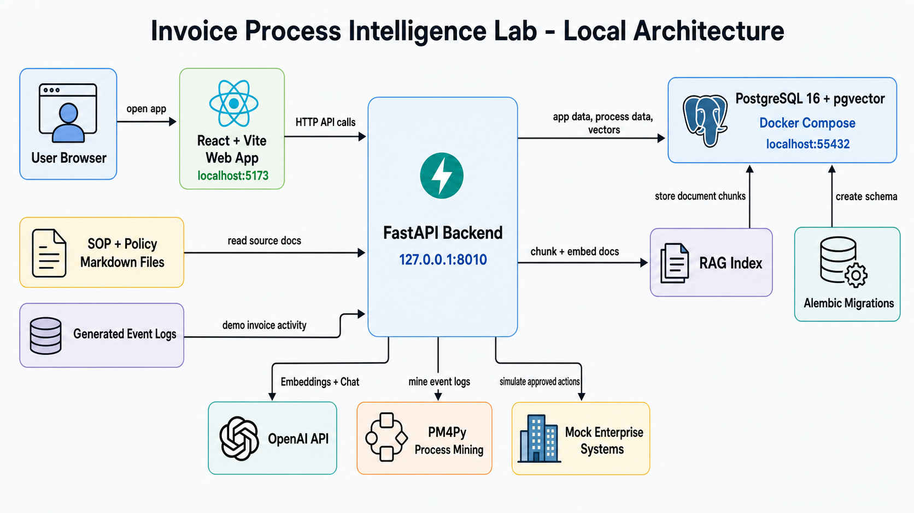

# Invoice Process Intelligence Lab

Invoice Process Intelligence Lab is a local demo app that helps you understand how invoices move through a business process. It shows the ideal process, creates demo invoice activity, mines the actual process from that activity, compares the two views, and uses SOP and policy files to explain problems in plain language.

The fastest way to learn the app is to move through the tabs from left to right. Each screen tells one part of the story, and the screenshots below show what you should expect to see when the app is running.

## What The App Does

The app is built around a simple idea. A company has a process it wants people and systems to follow, but the real process often includes delays, exceptions, missing purchase orders, duplicate checks, approvals, rejected invoices, and manual reviews. This app lets you see both sides in one place.

You can generate a clean invoice process model, create demo event data, mine the real process from that data, inspect SOPs and policies, build a RAG index from those files, ask questions about the process, and generate improvement ideas. The app also includes a custom process tab where you can describe a process in normal language and get a visual process graph back.

Nothing in this demo connects to real SAP, Coupa, ServiceNow, or email systems. Those integrations are mocked so you can learn the workflow without touching a real business system and without worrying that a test action will affect live invoices.

## Before You Start

Run the database with Docker Compose, then start the API from `apps/api` and the web app from `apps/web`. When both services are running, open the local web address shown by the frontend terminal.

The database uses PostgreSQL with pgvector so the app can store chunks and embeddings. The AI features need `OPENAI_API_KEY` in your local environment. If the key is missing or the account has no available quota, the app still opens, but AI actions such as RAG answers, improvement generation, and custom process generation will return an error.

## Technology Stack And Architecture



The project is a local full-stack demo. Docker runs the database. The API and web app run directly on your computer so you can edit and restart them quickly while developing.

The frontend is a React app built with Vite, TypeScript, Tailwind CSS, React Flow, and bpmn-js. It runs at `http://localhost:5173` and gives you the screens for the BPM model, generated event data, process mining, SOPs, policies, RAG, AI analysis, improvement proposals, and mock agents. The frontend does not talk to the database directly. It calls the API at `http://127.0.0.1:8010`.

The backend is a FastAPI app in `apps/api`. It owns the business workflow, database access, document ingestion, process mining, AI calls, and mock agent execution. SQLAlchemy handles database access, Alembic handles schema migrations, pandas and PM4Py handle process mining, and the OpenAI Python SDK handles embeddings and chat calls.

The database is PostgreSQL 16 with pgvector, started by `docker-compose.yml` on local port `55432`. PostgreSQL stores generated processes, event logs, mined process results, document chunks, embedding vectors, RAG queries, improvement proposals, approved actions, agent runs, and mock system configuration output. pgvector is used because RAG needs vector storage for document embeddings.

Alembic creates the PostgreSQL schema before the app is used. This matters because Docker only starts an empty PostgreSQL container. The command `alembic upgrade head` creates the tables and enables the vector extension through the migrations.

The RAG source material lives as markdown files under `docs/sop-repository` and `docs/policy-repository`. When you rebuild the RAG index, the API reads those files, splits them into chunks, sends the chunks to OpenAI for embeddings, and stores the chunks plus vectors in PostgreSQL. Later AI questions search those stored chunks first, then send the relevant context to OpenAI chat.

Process mining starts with generated invoice event logs. The API creates demo invoice activity with cases, timestamps, invoice metadata, exceptions, hidden steps, and bottlenecks. PM4Py analyzes that event log and returns mined process variants, direct-follows graphs, bottlenecks, and hidden issues. The frontend renders those results so you can compare the ideal BPM process with the actual generated activity.

The agents screen uses mock enterprise systems only. Approved improvement actions can produce mock configuration JSON and audit trail records, but the app never calls real SAP, Coupa, ServiceNow, payment, banking, email, or ticketing APIs. This keeps the project safe for a public local demo.

Local runtime flow:

1. Browser opens the Vite app at `localhost:5173`.
2. React calls FastAPI endpoints at `127.0.0.1:8010`.
3. FastAPI reads or writes PostgreSQL data through SQLAlchemy.
4. PostgreSQL runs in Docker at `localhost:55432`.
5. SOP and policy markdown files feed the RAG index.
6. OpenAI provides embeddings and chat responses when `OPENAI_API_KEY` is configured.
7. PM4Py mines generated event logs inside the API process.
8. Mock agents simulate approved enterprise-system actions and store the audit trail.

## Three Minute Walkthrough

Start on the landing screen and use it as your orientation point. Then open the BPM Model tab to see the clean process the business wants to follow. After that, generate real data, mine the process, review SOPs and policies, rebuild the RAG index, ask an AI question, review improvement proposals, and finally try the agents screen.

You do not need process mining experience to use the app. The important thing is to look for the difference between what should happen and what actually happens. The app highlights bottlenecks, variants, hidden issues, and control points so you can focus on the problems that matter.

## Landing


The landing screen gives you the main overview of the lab. Use it to understand the purpose of the app before moving into the individual workflow tabs, especially if this is your first time seeing process mining or RAG in action.

This screen is useful when you open the app for the first time because it explains the story at a high level. Once you know the flow, you will usually spend more time in the process, RAG, analysis, and improvement tabs.

## BPM Model


The BPM Model tab shows the clean invoice process that the organization wants to follow. This is the reference model for the rest of the app, so it is the best place to understand the intended path before looking at messy real activity.

Use this screen to understand the intended path from invoice receipt to payment. The graph is interactive, so you can zoom, fit the view, reset the layout, and drag nodes when you need to inspect a specific part of the model.

## Generate Your Own Process


The Generate Your Own Process tab lets you describe a process in normal language. You can write something very detailed, such as a finance approval workflow, or something broad, such as a customer onboarding process.

When the description is broad, the app asks the model to infer a reasonable process structure before drawing the graph. The result includes the visual process, a legend, and a short explanation of the boxes so you can understand what each part means.

## Generate Real Data


The Generate Real Data tab creates the event data used by the mining screen. Think of this as the app producing a realistic history of invoices moving through systems and teams, including both normal work and common exceptions.

Use this tab when you want a fresh demo dataset. The generated activity gives the process mining views something to analyze, including normal cases, exceptions, delays, retries, and rejected invoices.

## Mine Process


The Mine Process tab turns event data into an actual process view. This is where you see what really happened in the generated invoice cases instead of only seeing the process the business wanted.

Use this screen to compare the real flow with the ideal flow from the BPM Model tab. The most useful parts are the top variants, hidden issues, bottlenecks, and places where the process repeats or detours.

## SOPs


The SOPs tab shows the standard operating procedure files that support the invoice process. These files explain how people should handle routine invoice work, exceptions, approvals, corrections, and handoffs.

Use this screen to inspect the source documents before they are ingested into the RAG index. The point is to keep the documents as real files first, then let the app chunk and embed them later.

## Policies


The Policies tab shows the policy files used by the process. Policies are different from SOPs because they define rules, thresholds, responsibilities, controls, and compliance requirements.

Use this screen to check whether the policy content makes sense before building the RAG index. Good policies should be specific enough to explain why an approval is needed, when an invoice must be blocked, and what control should apply.

## RAG Index


The RAG Index tab shows how the SOP and policy files were chunked and embedded in the database. This is the best place to verify that the app is not treating the documents as one flat block of text.

Select a document file to see its content, then inspect the chunks created from that file. The embedding view helps you confirm that each chunk has a stored vector, which is what allows the AI analysis screens to retrieve relevant policy and SOP context.

## AI Analysis


The AI Analysis tab lets you ask questions about the invoice process. The app retrieves relevant chunks from the SOP and policy files, then uses that context to answer in a way that is tied back to the documents.

Use this screen when you want to understand why something is happening or what the documented procedure says. For example, you can ask why missing purchase orders create delays, which policy controls duplicate invoices, or what should happen when an invoice exceeds an approval threshold.

## Improve Process


The Improve Process tab proposes changes based on the mined process and the document context. It is designed to turn analysis into concrete actions that a business user can review before anything is simulated.

Use this screen to review bottlenecks, approve improvement ideas, and generate a clear recommendation. The app keeps the suggested changes tied to the process evidence so the proposal does not become a random list of ideas.

## Agents


The Agents tab shows the automation side of the demo. It simulates what an agent could do after an improvement is approved, such as preparing an action for a business system or notifying the right team.

Use this screen to run the mock workflow and see how an action would move through enterprise systems. The systems are simulated, so this screen is for learning and demonstration rather than production execution.

## How To Use The App Safely

Treat the app as a local learning lab. Generate data, inspect the mined process, read the documents, rebuild the RAG index, ask questions, and test improvements as many times as you want before using the ideas elsewhere.

When you care about a specific result, start by checking the source files in the SOPs and Policies tabs. Then check the RAG Index tab to confirm that those files were chunked and embedded correctly. After that, use AI Analysis and Improve Process with more confidence because you know what source material the app is using.

## What To Look For

The most important signs are delays, repeated reviews, missing purchase orders, duplicate invoice checks, approval thresholds, rejected invoices, and payment blocks. These are the places where invoice processes usually slow down or create control risk.

The app is most useful when you compare screens instead of reading one screen alone. The BPM Model shows the intended process, Mine Process shows what happened, SOPs and Policies show what the organization says should happen, and AI Analysis explains the connection between them.

## Run Locally

You need Docker Desktop, Python 3.12 or newer, and Node.js 20.19+ or 22.12+. Docker is used for PostgreSQL with pgvector. The API and web app run on your computer.

Clone the repo:

```bash
git clone https://github.com/jmpanal/invoice-process-mining.git
cd invoice-process-mining
```

Create local environment config:

```powershell
Copy-Item .env.example .env
```

On macOS or Linux:

```bash
cp .env.example .env
```

Open `.env` and set `OPENAI_API_KEY` if you want RAG, AI analysis, improvement generation, and custom process generation to work. The app opens without a key, but those AI actions return an OpenAI configuration error.

Start the database from the repo root:

```bash
docker compose up -d
docker compose ps
```

Start the API in a second terminal:

```powershell
cd apps/api
py -3.12 -m venv .venv
.\.venv\Scripts\python -m pip install --upgrade pip
.\.venv\Scripts\python -m pip install -e ".[dev]"
.\.venv\Scripts\python -m alembic upgrade head
.\.venv\Scripts\python -m uvicorn app.main:app --host 127.0.0.1 --port 8010 --reload
```

On macOS or Linux:

```bash
cd apps/api
python3.12 -m venv .venv
.venv/bin/python -m pip install --upgrade pip
.venv/bin/python -m pip install -e ".[dev]"
.venv/bin/python -m alembic upgrade head
.venv/bin/python -m uvicorn app.main:app --host 127.0.0.1 --port 8010 --reload
```

Start the web app in a third terminal:

```bash
cd apps/web
npm ci
npm run dev
```

Open `http://localhost:5173`. The web app calls the API at `http://127.0.0.1:8010` by default.

Useful checks:

```bash
curl http://127.0.0.1:8010/health
curl http://127.0.0.1:8010/health/db
```

First app flow:

1. Open the BPM Model tab and generate the ideal invoice process.
2. Open Generate Real Data and create demo invoice events.
3. Open Mine Process and run mining.
4. Open RAG Index and rebuild the index. This step needs `OPENAI_API_KEY`.
5. Use AI Analysis, Improve Process, and Agents after the earlier data exists.

Known local setup notes:

- `docker-compose.yml` starts only PostgreSQL with pgvector. It does not start the API or frontend.
- `alembic upgrade head` is required for PostgreSQL. Without it, the API can connect but the app tables will not exist.
- Keep `DATABASE_URL` pointed at `localhost:55432` unless you change the Docker Compose port.
- If port `8010` is busy, start the API on another port and set `VITE_API_BASE_URL` for the web app.
