# Invoice Process Intelligence Lab

Invoice Process Intelligence Lab is a local demo app that helps you understand how invoices move through a business process. It shows the ideal process, creates demo invoice activity, mines the actual process from that activity, compares the two views, and uses SOP and policy files to explain problems in plain language.

The fastest way to learn the app is to move through the tabs from left to right. Each screen tells one part of the story, and the screenshots below show what you should expect to see when the app is running.

## What The App Does

The app is built around a simple idea. A company has a process it wants people and systems to follow, but the real process often includes delays, exceptions, missing purchase orders, duplicate checks, approvals, rejected invoices, and manual reviews. This app lets you see both sides in one place.

You can generate a clean invoice process model, create demo event data, mine the real process from that data, inspect SOPs and policies, build a RAG index from those files, ask questions about the process, and generate improvement ideas. The app also includes a custom process tab where you can describe a process in normal language and get a visual process graph back.

Nothing in this demo connects to real SAP, Coupa, ServiceNow, or email systems. Those integrations are mocked so you can learn the workflow without touching a real business system and without worrying that a test action will affect live invoices.

## Before You Start

Run the database with Docker Compose, then start the API from `apps/api` and the web app from `apps/web`. When both services are running, open the local web address shown by the frontend terminal.

The database uses PostgreSQL with pgvector so the app can store chunks and embeddings. The AI features need `OPENAI_API_KEY` in your local environment. If the key is missing or the account has no available quota, the app still opens, but AI actions such as RAG answers, improvement generation, and custom process generation will return an error.

## Three Minute Walkthrough

Start on the landing screen and use it as your orientation point. Then open the BPM Model tab to see the clean process the business wants to follow. After that, generate real data, mine the process, review SOPs and policies, rebuild the RAG index, ask an AI question, review improvement proposals, and finally try the agents screen.

You do not need process mining experience to use the app. The important thing is to look for the difference between what should happen and what actually happens. The app highlights bottlenecks, variants, hidden issues, and control points so you can focus on the problems that matter.

## Landing

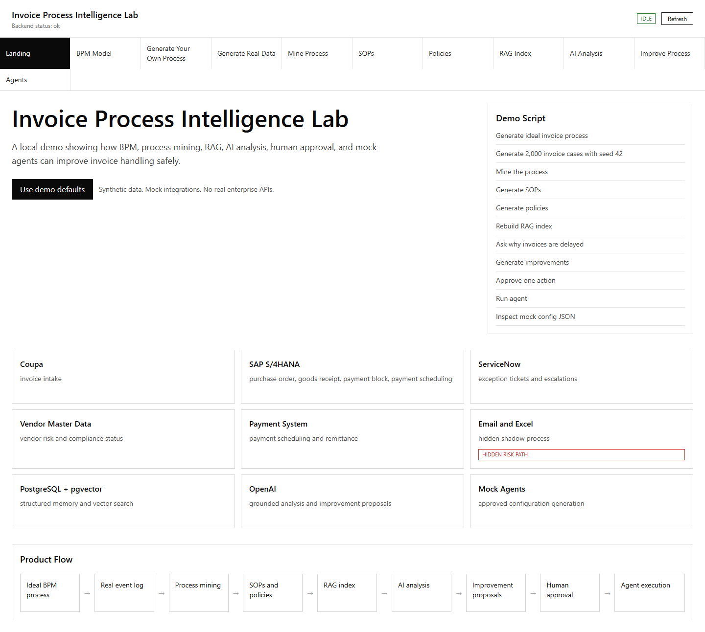

The landing screen gives you the main overview of the lab. Use it to understand the purpose of the app before moving into the individual workflow tabs, especially if this is your first time seeing process mining or RAG in action.

This screen is useful when you open the app for the first time because it explains the story at a high level. Once you know the flow, you will usually spend more time in the process, RAG, analysis, and improvement tabs.

## BPM Model

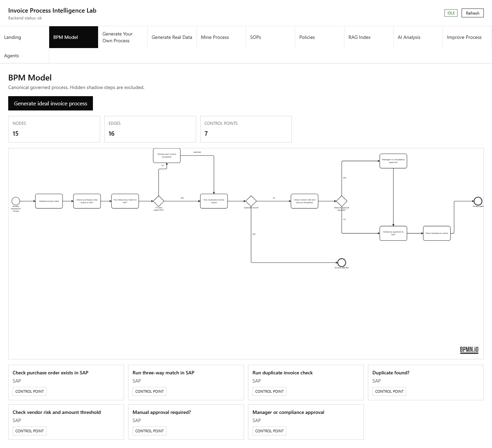

The BPM Model tab shows the clean invoice process that the organization wants to follow. This is the reference model for the rest of the app, so it is the best place to understand the intended path before looking at messy real activity.

Use this screen to understand the intended path from invoice receipt to payment. The graph is interactive, so you can zoom, fit the view, reset the layout, and drag nodes when you need to inspect a specific part of the model.

## Generate Your Own Process

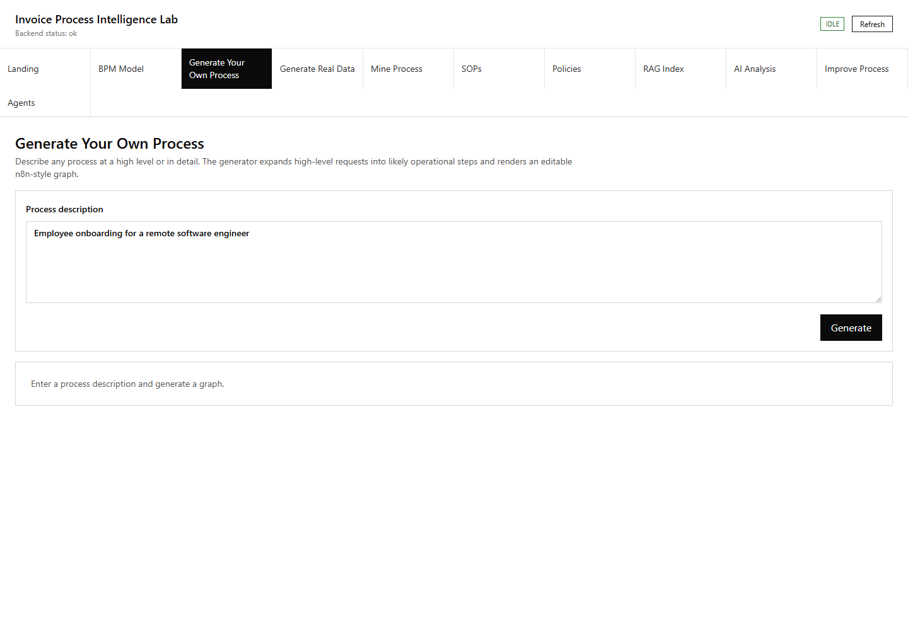

The Generate Your Own Process tab lets you describe a process in normal language. You can write something very detailed, such as a finance approval workflow, or something broad, such as a customer onboarding process.

When the description is broad, the app asks the model to infer a reasonable process structure before drawing the graph. The result includes the visual process, a legend, and a short explanation of the boxes so you can understand what each part means.

## Generate Real Data

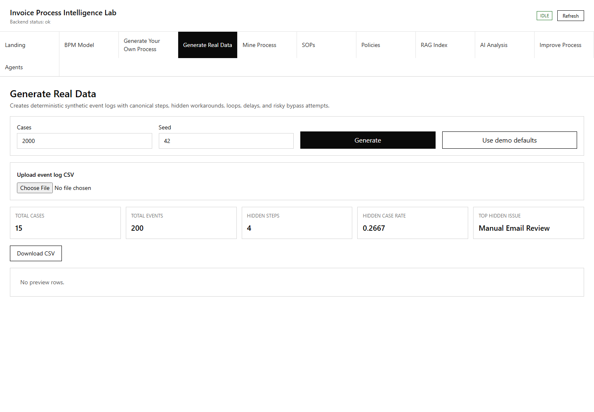

The Generate Real Data tab creates the event data used by the mining screen. Think of this as the app producing a realistic history of invoices moving through systems and teams, including both normal work and common exceptions.

Use this tab when you want a fresh demo dataset. The generated activity gives the process mining views something to analyze, including normal cases, exceptions, delays, retries, and rejected invoices.

## Mine Process

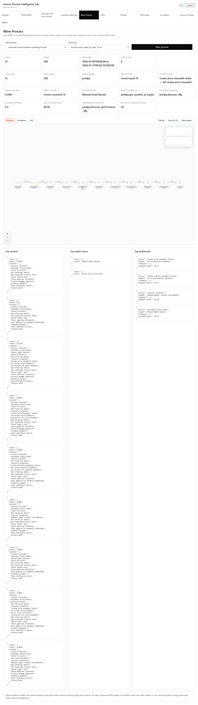

The Mine Process tab turns event data into an actual process view. This is where you see what really happened in the generated invoice cases instead of only seeing the process the business wanted.

Use this screen to compare the real flow with the ideal flow from the BPM Model tab. The most useful parts are the top variants, hidden issues, bottlenecks, and places where the process repeats or detours.

## SOPs

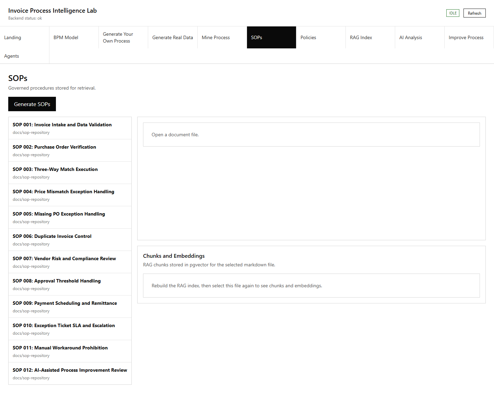

The SOPs tab shows the standard operating procedure files that support the invoice process. These files explain how people should handle routine invoice work, exceptions, approvals, corrections, and handoffs.

Use this screen to inspect the source documents before they are ingested into the RAG index. The point is to keep the documents as real files first, then let the app chunk and embed them later.

## Policies

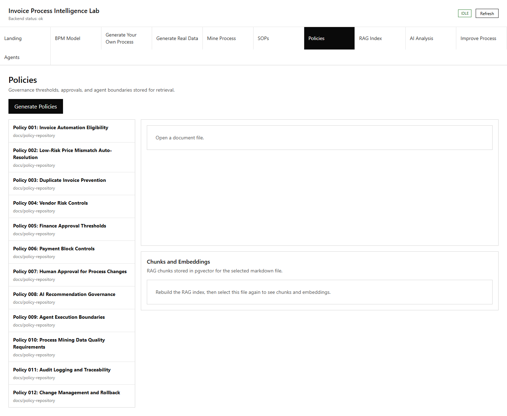

The Policies tab shows the policy files used by the process. Policies are different from SOPs because they define rules, thresholds, responsibilities, controls, and compliance requirements.

Use this screen to check whether the policy content makes sense before building the RAG index. Good policies should be specific enough to explain why an approval is needed, when an invoice must be blocked, and what control should apply.

## RAG Index

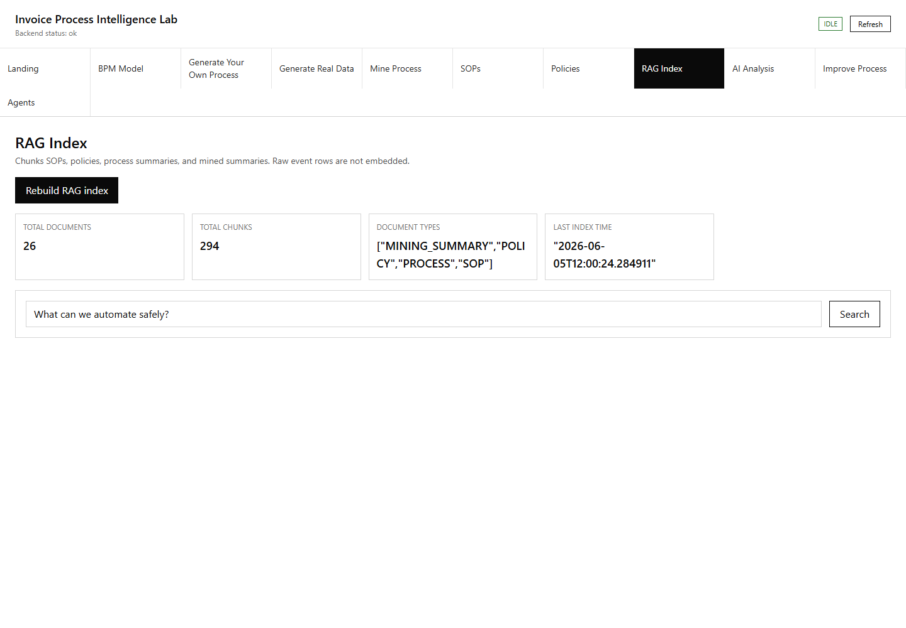

The RAG Index tab shows how the SOP and policy files were chunked and embedded in the database. This is the best place to verify that the app is not treating the documents as one flat block of text.

Select a document file to see its content, then inspect the chunks created from that file. The embedding view helps you confirm that each chunk has a stored vector, which is what allows the AI analysis screens to retrieve relevant policy and SOP context.

## AI Analysis

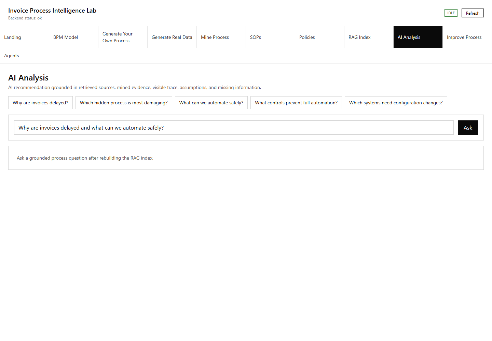

The AI Analysis tab lets you ask questions about the invoice process. The app retrieves relevant chunks from the SOP and policy files, then uses that context to answer in a way that is tied back to the documents.

Use this screen when you want to understand why something is happening or what the documented procedure says. For example, you can ask why missing purchase orders create delays, which policy controls duplicate invoices, or what should happen when an invoice exceeds an approval threshold.

## Improve Process

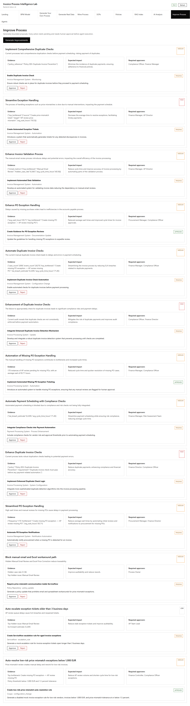

The Improve Process tab proposes changes based on the mined process and the document context. It is designed to turn analysis into concrete actions that a business user can review before anything is simulated.

Use this screen to review bottlenecks, approve improvement ideas, and generate a clear recommendation. The app keeps the suggested changes tied to the process evidence so the proposal does not become a random list of ideas.

## Agents

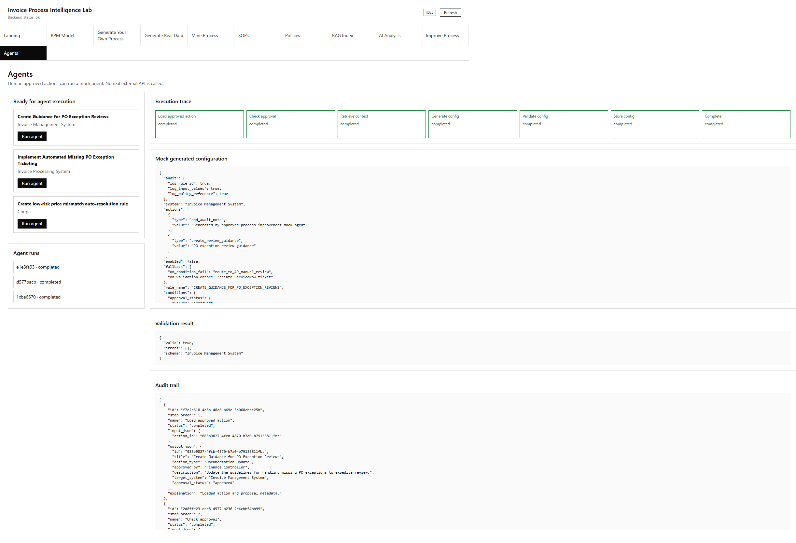

The Agents tab shows the automation side of the demo. It simulates what an agent could do after an improvement is approved, such as preparing an action for a business system or notifying the right team.

Use this screen to run the mock workflow and see how an action would move through enterprise systems. The systems are simulated, so this screen is for learning and demonstration rather than production execution.

## How To Use The App Safely

Treat the app as a local learning lab. Generate data, inspect the mined process, read the documents, rebuild the RAG index, ask questions, and test improvements as many times as you want before using the ideas elsewhere.

When you care about a specific result, start by checking the source files in the SOPs and Policies tabs. Then check the RAG Index tab to confirm that those files were chunked and embedded correctly. After that, use AI Analysis and Improve Process with more confidence because you know what source material the app is using.

## What To Look For

The most important signs are delays, repeated reviews, missing purchase orders, duplicate invoice checks, approval thresholds, rejected invoices, and payment blocks. These are the places where invoice processes usually slow down or create control risk.

The app is most useful when you compare screens instead of reading one screen alone. The BPM Model shows the intended process, Mine Process shows what happened, SOPs and Policies show what the organization says should happen, and AI Analysis explains the connection between them.
